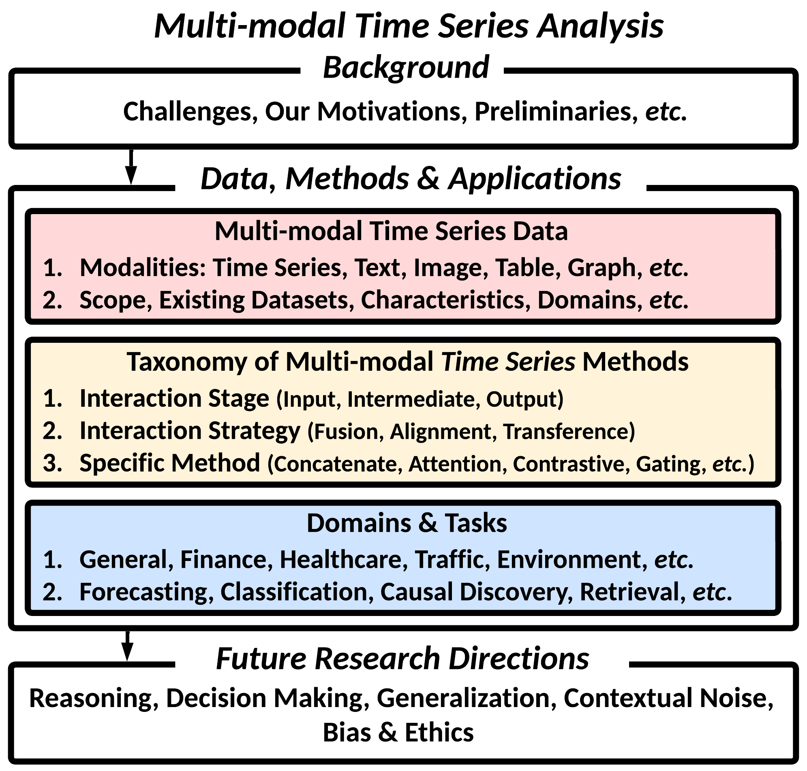
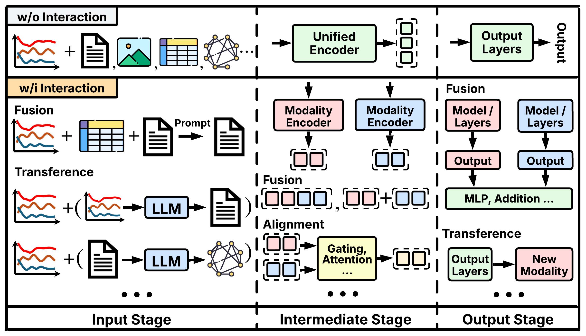

# Multi-modal-Time-Series-Analysis
This is the official repository for "Multi-modal Time Series Analysis: A Tutorial and Survey".

This repository is maintained by [*Yushan Jiang*](https://sites.google.com/view/jayjiang/home) and [*Kanghui Ning*](https://kanghui-learning.github.io/) from ***UConn DSIS***.

Please consider [citing](#citation) our survey paper if you find it helpful :), and feel free to share this repository with others! 


## Motivation and Contribution:
This survey aims to provide a unique and systematic perspective on ***effectively leveraging cross-modal interactions from relevant real-world contexts to advance multi-modal time series analysis***, addressing both foundational principles and practical solutions. Our assessment is threefold: 

- Reviewing multi-modal time series data
- Analyzing cross-modal interactions between time series and other modalities (*Fusion*, *Alignment*, *Transference*) 
- Demonstrating revealing the impact of multi-modal time series analysis in applications across diverse domains.

|[](image.png) |[](image1.png)|
|:--:|:--:| 
| *Figure 1: The Framework of Our Survey* | *Figure 2: Categorization of cross-modal interaction methods and representative examples* |

## Taxonomy of Representative Multi-Modal Time Series Methods

We define three fundamental types of interactions between time series and other modalities, including ***Fusion***, ***Alignment***, and ***Transference***, which occur at different stages within a framework --- ***Input***, ***Intermediate*** (*i.e.*, representations or intermediate outputs), and ***Output***.
- ***Fusion*** refers to the process of integrating heterogeneous modalities in a way that captures complementary information across diverse sources to improve time series modeling.
- ***Alignment*** ensures that the relationships between different modalities are preserved and semantically coherent when integrated into a unified learning framework.
- ***Transference*** refers to the process of mapping between different modalities, which allows one modality to be inferred, translated, or synthesized from another. 

> **Note:**
> - F: Fusion; A: Alignment; T: Transference

<div style="transform: scale(0.8); transform-origin: top left;">

<table>
<tr>
<th><sub>Method</sub></th>
<th><sub>Modality</sub></th>
<th><sub>Domain</sub></th>
<th><sub>Task</sub></th>
<th><sub>Stage</sub></th>
<th><sub>F</sub></th>
<th><sub>A</sub></th>
<th><sub>T</sub></th>
<th><sub>Method</sub></th>
<th><sub>Large Model</sub></th>
</tr>
<tr>
<td><strong><sub>Time-MMD</sub></strong> </br><a href="https://arxiv.org/abs/2406.08627"><sup><sub>(NeurIPS 2024)</sub></sup></a>&nbsp<a href="https://github.com/AdityaLab/Time-MMD"><sup><sub>Code</sub></sup></a></td>
<td><sub>TS, Text</sub></td>
<td><sub>General</sub></td>
<td><sub>Forecasting</sub></td>
<td><sub>Output</sub></td>
<td><sub>✔</sub></td>
<td><sub>✘</sub></td>
<td><sub>✘</sub></td>
<td><sub>Addition</sub></td>
<td><sub>Multiple</sub></td>
</tr>
<tr>
<td rowspan="2"><strong><sub>Wang et al.</sub></strong> </br><a href="https://neurips.cc/virtual/2024/poster/93316"><sup><sub>(NeurIPS 2024)</sub></sup></a>&nbsp<a href="https://github.com/ameliawong1996/From_News_to_Forecast"><sup><sub>Code</sub></sup></a></td>
<td rowspan="2"><sub>TS, Text</sub></td>
<td rowspan="2"><sub>General</sub></td>
<td rowspan="2"><sub>Forecasting</sub></td>
<td><sub>Input</sub></td>
<td><sub>✔</sub></td>
<td><sub>✘</sub></td>
<td><sub>✘</sub></td>
<td><sub>Prompt</sub></td>
<td rowspan="2"><sub>LLaMa2, GPT-4 Turbo</sub></td>
</tr>
<tr>
<td><sub>Intermediate</sub></td>
<td><sub>✔</sub></td>
<td><sub>✔</sub></td>
<td><sub>✘</sub></td>
<td><sub>Prompt; LLM reasoning</sub></td>
</tr>
<tr>
<td><strong><sub>GPT4MTS</sub></strong> </br><a href="https://ojs.aaai.org/index.php/AAAI/article/view/30383"><sup><sub>(AAAI 2024)</sub></sup></a></td>
<td><sub>TS, Text</sub></td>
<td><sub>General</sub></td>
<td><sub>Forecasting</sub></td>
<td><sub>Intermediate</sub></td>
<td><sub>✔</sub></td>
<td><sub>✔</sub></td>
<td><sub>✘</sub></td>
<td><sub>Addition; Self-attention</sub></td>
<td><sub>GPT-2</sub></td>
</tr>
<tr>
<td rowspan="2"><strong><sub>TimeCMA</sub></strong> </br><a href="https://arxiv.org/abs/2406.01638"><sup><sub>(AAAI 2025)</sub></sup></a>&nbsp<a href="https://github.com/ChenxiLiu-HNU/TimeCMA"><sup><sub>Code</sub></sup></a></td>
<td rowspan="2"><sub>TS, Text</sub></td>
<td rowspan="2"><sub>General</sub></td>
<td rowspan="2"><sub>Forecasting</sub></td>
<td><sub>Input</sub></td>
<td><sub>✘</sub></td>
<td><sub>✘</sub></td>
<td><sub>✔</sub></td>
<td><sub>Meta-description</sub></td>
<td rowspan="2"><sub>GPT-2</sub></td>
</tr>
<tr>
<td><sub>Intermediate</sub></td>
<td><sub>✔</sub></td>
<td><sub>✔</sub></td>
<td><sub>✘</sub></td>
<td><sub>Addition; Cross-attention</sub></td>
</tr>
<tr>
<td rowspan="2"><strong><sub>MOAT</sub></strong> </br><a href="https://openreview.net/forum?id=uRXxnoqDHH"><sup><sub>(2024)</sub></sup></a></td>
<td rowspan="2"><sub>TS, Text</sub></td>
<td rowspan="2"><sub>General</sub></td>
<td rowspan="2"><sub>Forecasting</sub></td>
<td><sub>Intermediate</sub></td>
<td><sub>✔</sub></td>
<td><sub>✔</sub></td>
<td><sub>✘</sub></td>
<td><sub>Concat.; Self-attention</sub></td>
<td rowspan="2"><sub>S-Bert</sub></td>
</tr>
<tr>
<td><sub>Output</sub></td>
<td><sub>✔</sub></td>
<td><sub>✘</sub></td>
<td><sub>✘</sub></td>
<td><sub>Offline synthesis</sub></td>
</tr>
<tr>
<td rowspan="3"><strong><sub>TimeCAP</sub></strong> </br><a href="https://arxiv.org/abs/2502.11418"><sup><sub>(AAAI 2025)</sub></sup></a></td>
<td rowspan="3"><sub>TS, Text</sub></td>
<td rowspan="3"><sub>General</sub></td>
<td rowspan="3"><sub>Classification</sub></td>
<td><sub>Input</sub></td>
<td><sub>✘</sub></td>
<td><sub>✘</sub></td>
<td><sub>✔</sub></td>
<td><sub>LLM Generation</sub></td>
<td rowspan="3"><sub>Bert, GPT-4</sub></td>
</tr>
<tr>
<td><sub>Intermediate</sub></td>
<td><sub>✔</sub></td>
<td><sub>✔</sub></td>
<td><sub>✘</sub></td>
<td><sub>Concat.; Self-attention, Retrieval</sub></td>
</tr>
<tr>
<td><sub>Output</sub></td>
<td><sub>✔</sub></td>
<td><sub>✘</sub></td>
<td><sub>✘</sub></td>
<td><sub>Addition</sub></td>
</tr>
<tr>
<td rowspan="2"><strong><sub>TimeXL</sub></strong> </br><a href="https://arxiv.org/abs/2503.01013"><sup><sub>(2025)</sub></sup></a></td>
<td rowspan="2"><sub>TS, Text</sub></td>
<td rowspan="2"><sub>General</sub></td>
<td><sub>Classification</sub></td>
<td><sub>Intermediate</sub></td>
<td><sub>✔</sub></td>
<td><sub>✔</sub></td>
<td><sub>✘</sub></td>
<td><sub>Concat., Prompt; LLM Reasoning</sub></td>
<td rowspan="2"><sub>Bert, S-Bert, GPT-4o</sub></td>
</tr>
<tr>
<td><sub>Forecasting</sub></td>
<td><sub>Output</sub></td>
<td><sub>✔</sub></td>
<td><sub>✘</sub></td>
<td><sub>✘</sub></td>
<td><sub>Addition</sub></td>
</tr>
<tr>
<td><strong><sub>Hybrid-MMF</sub></strong> </br><a href="https://arxiv.org/abs/2411.06735"><sup><sub>(2024)</sub></sup></a>&nbsp<a href="https://github.com/Rose-STL-Lab/Multimodal_Forecasting"><sup><sub>Code</sub></sup></a></td>
<td><sub>TS, Text</sub></td>
<td><sub>General</sub></td>
<td><sub>Forecasting</sub></td>
<td><sub>Intermediate</sub></td>
<td><sub>✔</sub></td>
<td><sub>✘</sub></td>
<td><sub>✘</sub></td>
<td><sub>Concat.</sub></td>
<td><sub>GPT-4o</sub></td>
</tr>
<tr>
<td rowspan="2"><strong><sub>Time-LLM</sub></strong> </br><a href="https://openreview.net/forum?id=Unb5CVPtae"><sup><sub>(ICLR 2024)</sub></sup></a>&nbsp<a href="https://github.com/kimmeen/time-llm"><sup><sub>Code</sub></sup></a></td>
<td rowspan="2"><sub>TS, Text</sub></td>
<td rowspan="2"><sub>General</sub></td>
<td rowspan="2"><sub>Forecasting</sub></td>
<td><sub>Input</sub></td>
<td><sub>✘</sub></td>
<td><sub>✘</sub></td>
<td><sub>✔</sub></td>
<td><sub>Meta-description</sub></td>
<td rowspan="2"><sub>LLaMA, GPT-2</sub></td>
</tr>
<tr>
<td><sub>Intermediate</sub></td>
<td><sub>✔</sub></td>
<td><sub>✔</sub></td>
<td><sub>✘</sub></td>
<td><sub>Concat.; Self-attention</sub></td>
</tr>
<tr>
<td rowspan="2"><strong><sub>Time-VLM</sub></strong> </br><a href="https://arxiv.org/abs/2502.04395"><sup><sub>(2025)</sub></sup></a></td>
<td rowspan="2"><sub>TS, Text, Image</sub></td>
<td rowspan="2"><sub>General</sub></td>
<td rowspan="2"><sub>Forecasting</sub></td>
<td><sub>Input</sub></td>
<td><sub>✘</sub></td>
<td><sub>✘</sub></td>
<td><sub>✔</sub></td>
<td><sub>Feat. Imaging, Meta-description</sub></td>
<td rowspan="2"><sub>ViLT, CLIP, BLIP-2</sub></td>
</tr>
<tr>
<td><sub>Intermediate</sub></td>
<td><sub>✔</sub></td>
<td><sub>✔</sub></td>
<td><sub>✘</sub></td>
<td><sub>Addition; Gating, Cross-attention</sub></td>
</tr>
<tr>
<td rowspan="2"><strong><sub>Unitime</sub></strong> </br><a href="https://dl.acm.org/doi/10.1145/3589334.3645434"><sup><sub>(WWW 2024)</sub></sup></a></td>
<td rowspan="2"><sub>TS, Text</sub></td>
<td rowspan="2"><sub>General</sub></td>
<td rowspan="2"><sub>Forecasting</sub></td>
<td><sub>Input</sub></td>
<td><sub>✘</sub></td>
<td><sub>✘</sub></td>
<td><sub>✔</sub></td>
<td><sub>Meta-description</sub></td>
<td rowspan="2"><sub>GPT-2</sub></td>
</tr>
<tr>
<td><sub>Intermediate</sub></td>
<td><sub>✔</sub></td>
<td><sub>✔</sub></td>
<td><sub>✘</sub></td>
<td><sub>Concat.; Self-attention</sub></td>
</tr>
<tr>
<td><strong><sub>TESSA</sub></strong> </br><a href="https://arxiv.org/abs/2410.17462"><sup><sub>(2024)</sub></sup></a></td>
<td><sub>TS, Text</sub></td>
<td><sub>General</sub></td>
<td><sub>Annotation</sub></td>
<td><sub>Intermediate</sub></td>
<td><sub>✔</sub></td>
<td><sub>✔</sub></td>
<td><sub>✔</sub></td>
<td><sub>Prompt; RL; LLM Generation</sub></td>
<td><sub>GPT-4o</sub></td>
</tr>
<tr>
<td><strong><sub>InstrucTime</sub></strong> </br><a href="https://dl.acm.org/doi/10.1145/3701551.3703499"><sup><sub>(WSDM 2025)</sub></sup></a>&nbsp<a href="https://github.com/Mingyue-Cheng/InstructTime"><sup><sub>Code</sub></sup></a></td>
<td><sub>TS, Text</sub></td>
<td><sub>General</sub></td>
<td><sub>Classification</sub></td>
<td><sub>Intermediate</sub></td>
<td><sub>✔</sub></td>
<td><sub>✔</sub></td>
<td><sub>✘</sub></td>
<td><sub>Concat.; Self-attention</sub></td>
<td><sub>GPT-2</sub></td>
</tr>
<tr>
<td><strong><sub>MATMCD</sub></strong> </br><a href="http://arxiv.org/abs/2412.13667"><sup><sub>(2024)</sub></sup></a></td>
<td><sub>TS, Text, Graph</sub></td>
<td><sub>General</sub></td>
<td><sub>Causal Discovery</sub></td>
<td><sub>Intermediate</sub></td>
<td><sub>✔</sub></td>
<td><sub>✔</sub></td>
<td><sub>✔</sub></td>
<td><sub>Prompt; LLM Reasoning; Supervision</sub></td>
<td><sub>Multiple</sub></td>
</tr>
<tr>
<td><strong><sub>STG-LLM</sub></strong> </br><a href="https://arxiv.org/abs/2401.14192"><sup><sub>(2024)</sub></sup></a></td>
<td><sub>ST, Text</sub></td>
<td><sub>General</sub></td>
<td><sub>Forecasting</sub></td>
<td><sub>Intermediate</sub></td>
<td><sub>✔</sub></td>
<td><sub>✔</sub></td>
<td><sub>✘</sub></td>
<td><sub>Concat.; Self-attention</sub></td>
<td><sub>GPT-2</sub></td>
</tr>
<tr>
<td><strong><sub>TableTime</sub></strong> </br><a href="https://arxiv.org/abs/2411.15737"><sup><sub>(2024)</sub></sup></a>&nbsp<a href="https://anonymous.4open.science/r/TableTime-5E4D/README.md"><sup><sub>Code</sub></sup></a></td>
<td><sub>TS, Text</sub></td>
<td><sub>General</sub></td>
<td><sub>Classification</sub></td>
<td><sub>Input</sub></td>
<td><sub>✔</sub></td>
<td><sub>✘</sub></td>
<td><sub>✔</sub></td>
<td><sub>Prompt; Reformulate</sub></td>
<td><sub>Multiple</sub></td>
</tr>
<tr>
<td><strong><sub>ContextFormer</sub></strong> </br><a href="https://arxiv.org/abs/2410.12672"><sup><sub>(2024)</sub></sup></a></td>
<td><sub>TS, Tabular</sub></td>
<td><sub>General</sub></td>
<td><sub>Forecasting</sub></td>
<td><sub>Intermediate</sub></td>
<td><sub>✔</sub></td>
<td><sub>✔</sub></td>
<td><sub>✘</sub></td>
<td><sub>Addition; Cross-attention</sub></td>
<td><sub>No</sub></td>
</tr>
<tr>
<td><strong><sub>Time-MQA</sub></strong> </br><a href="https://www.arxiv.org/abs/2503.01875"><sup><sub>(2025)</sub></sup></a>&nbsp<a href="https://huggingface.co/Time-QA"><sup><sub>Code</sub></sup></a></td>
<td><sub>TS, Text</sub></td>
<td><sub>General</sub></td>
<td><sub>Multiple</sub></td>
<td><sub>Input</sub></td>
<td><sub>✔</sub></td>
<td><sub>✘</sub></td>
<td><sub>✘</sub></td>
<td><sub>Prompt</sub></td>
<td><sub>Multiple</sub></td>
</tr>
<tr>
<td><strong><sub>MAN-SF</sub></strong> </br><a href="https://aclanthology.org/2020.emnlp-main.676/"><sup><sub>(EMNLP 2020)</sub></sup></a></td>
<td><sub>TS, Text, Graph</sub></td>
<td><sub>Finance</sub></td>
<td><sub>Classification</sub></td>
<td><sub>Intermediate</sub></td>
<td><sub>✔</sub></td>
<td><sub>✔</sub></td>
<td><sub>✘</sub></td>
<td><sub>Bilinear; Graph Convolution</sub></td>
<td><sub>USE</sub></td>
</tr>
<tr>
<td rowspan="2"><strong><sub>Bamford et al.</sub></strong> </br><a href="https://dl.acm.org/doi/10.1145/3604237.3626901"><sup><sub>(ICAIF 2023)</sub></sup></a></td>
<td><sub>TS, Text</sub></td>
<td rowspan="2"><sub>Finance</sub></td>
<td rowspan="2"><sub>Retrieval</sub></td>
<td><sub>Intermediate</sub></td>
<td><sub>✘</sub></td>
<td><sub>✔</sub></td>
<td><sub>✘</sub></td>
<td rowspan="2"><sub>Supervision</sub></td>
<td rowspan="2"><sub>S-bert</sub></td>
</tr>
<tr>
<td><sub>TS, Image</sub></td>
<td><sub>Output</sub></td>
<td><sub>✘</sub></td>
<td><sub>✘</sub></td>
<td><sub>✔</sub></td>
<td></td>
</tr>
<tr>
<td rowspan="2"><strong><sub>Chen et al.</sub></strong> </br><a href="https://papers.ssrn.com/sol3/papers.cfm?abstract_id=4464002"><sup><sub>(2023)</sub></sup></a></td>
<td rowspan="2"><sub>TS, Text, Graph</sub></td>
<td rowspan="2"><sub>Finance</sub></td>
<td rowspan="2"><sub>Classification</sub></td>
<td><sub>Intermediate</sub></td>
<td><sub>✘</sub></td>
<td><sub>✘</sub></td>
<td><sub>✔</sub></td>
<td><sub>LLM Generation</sub></td>
<td rowspan="2"><sub>ChatGPT</sub></td>
</tr>
<tr>
<td></td>
<td><sub>✔</sub></td>
<td><sub>✔</sub></td>
<td><sub>✘</sub></td>
<td><sub>Concat.; Graph Convolution</sub></td>
</tr>
<tr>
<td><strong><sub>Xie et al.</sub></strong> </br><a href="https://arxiv.org/abs/2304.05351"><sup><sub>(2023)</sub></sup></a></td>
<td><sub>TS, Text</sub></td>
<td><sub>Finance</sub></td>
<td><sub>Classification</sub></td>
<td><sub>Input</sub></td>
<td><sub>✔</sub></td>
<td><sub>✘</sub></td>
<td><sub>✘</sub></td>
<td><sub>Prompt</sub></td>
<td><sub>ChatGPT</sub></td>
</tr>
<tr>
<td><strong><sub>Yu et al.</sub></strong> </br><a href="https://aclanthology.org/2023.emnlp-industry.69/"><sup><sub>(EMNLP 2023)</sub></sup></a></td>
<td><sub>TS, Text</sub></td>
<td><sub>Finance</sub></td>
<td><sub>Forecasting</sub></td>
<td><sub>Input</sub></td>
<td><sub>✔</sub></td>
<td><sub>✘</sub></td>
<td><sub>✘</sub></td>
<td><sub>Prompt</sub></td>
<td><sub>GPT-4, Open LLaMA</sub></td>
</tr>
<tr>
<td><strong><sub>MedTsLLM</sub></strong> </br><a href="https://arxiv.org/abs/2408.07773"><sup><sub>(2024)</sub></sup></a>&nbsp<a href="https://github.com/flixpar/med-ts-llm"><sup><sub>Code</sub></sup></a></td>
<td><sub>TS, Text, Tabular</sub></td>
<td><sub>Healthcare</sub></td>
<td><sub>Multiple</sub></td>
<td><sub>Intermediate</sub></td>
<td><sub>✔</sub></td>
<td><sub>✔</sub></td>
<td><sub>✘</sub></td>
<td><sub>Concat.; Self-attention</sub></td>
<td><sub>Llama2</sub></td>
</tr>
<tr>
<td><strong><sub>RespLLM</sub></strong> </br><a href="https://arxiv.org/abs/2410.05361"><sup><sub>(2024)</sub></sup></a></td>
<td><sub>TS (Audio), Text</sub></td>
<td><sub>Healthcare</sub></td>
<td><sub>Classification</sub></td>
<td><sub>Intermediate</sub></td>
<td><sub>✔</sub></td>
<td><sub></sub></td>
<td><sub>✘</sub></td>
<td><sub>Addition, Self-attention</sub></td>
<td><sub>OpenBioLLM-8B</sub></td>
</tr>
<tr>
<td><strong><sub>METS</sub></strong> </br><a href="https://arxiv.org/abs/2303.12311"><sup><sub>(2023)</sub></sup></a></td>
<td><sub>TS, Text</sub></td>
<td><sub>Healthcare</sub></td>
<td><sub>Classification</sub></td>
<td><sub>Output</sub></td>
<td><sub>✘</sub></td>
<td><sub>✔</sub></td>
<td><sub>✘</sub></td>
<td><sub>Contrastive</sub></td>
<td><sub>ClinicalBert</sub></td>
</tr>
<tr>
<td><strong><sub>Wang et al.</sub></strong> </br><a href="https://cdn.aaai.org/ojs/20472/20472-13-24485-1-2-20220628.pdf"><sup><sub>(AAAI 2022)</sub></sup></a></td>
<td><sub>TS, Text</sub></td>
<td><sub>Healthcare</sub></td>
<td><sub>Classification</sub></td>
<td><sub>Intermediate</sub></td>
<td><sub>✘</sub></td>
<td><sub>✘</sub></td>
<td><sub>✔</sub></td>
<td><sub>Supervision</sub></td>
<td><sub>Bart, Bert, RoBerta</sub></td>
</tr>
<tr>
<td><strong><sub>EEG2TEXT</sub></strong> </br><a href="https://www.computer.org/csdl/proceedings-article/bigdata/2024/10825980/23yl5pp1fri"><sup><sub>(BigData 2024)</sub></sup></a></td>
<td><sub>TS, Text</sub></td>
<td><sub>Healthcare</sub></td>
<td><sub>Generation</sub></td>
<td><sub>Output</sub></td>
<td><sub>✘</sub></td>
<td><sub>✘</sub></td>
<td><sub>✔</sub></td>
<td><sub>Self-supervision, Supervision</sub></td>
<td><sub>Bart</sub></td>
</tr>
<tr>
<td><strong><sub>MEDHMP</sub></strong> </br><a href="https://aclanthology.org/2023.emnlp-main.171/"><sup><sub>(EMNLP 2023)</sub></sup></a>&nbsp<a href="https://github.com/XiaochenWang-PSU/MedHMP"><sup><sub>Code</sub></sup></a></td>
<td><sub>TS, Text</sub></td>
<td><sub>Healthcare</sub></td>
<td><sub>Classification</sub></td>
<td><sub>Intermediate</sub></td>
<td><sub>✔</sub></td>
<td><sub>✔</sub></td>
<td><sub>✘</sub></td>
<td><sub>Concat.; Self-attention, Contrastive</sub></td>
<td><sub>ClinicalT5</sub></td>
</tr>
<tr>
<td><strong><sub>Deznabi et al.</sub></strong> </br><a href="https://aclanthology.org/2021.findings-acl.352/"><sup><sub>(ACL 2021)</sub></sup></a>&nbsp<a href="https://github.com/Information-Fusion-Lab-Umass/ClinicalNotes_TimeSeries"><sup><sub>Code</sub></sup></a></td>
<td><sub>TS, Text</sub></td>
<td><sub>Healthcare</sub></td>
<td><sub>Classification</sub></td>
<td><sub>Intermediate</sub></td>
<td><sub>✔</sub></td>
<td><sub>✘</sub></td>
<td><sub>✘</sub></td>
<td><sub>Concat.</sub></td>
<td><sub>Bio+Clinical Bert</sub></td>
</tr>
<tr>
<td><strong><sub>Niu et al.</sub></strong> </br><a href="https://www.frontiersin.org/journals/molecular-biosciences/articles/10.3389/fmolb.2023.1136071/full"><sup><sub>(2023)</sub></sup></a></td>
<td><sub>TS, Text</sub></td>
<td><sub>Healthcare</sub></td>
<td><sub>Classification</sub></td>
<td><sub>Intermediate</sub></td>
<td><sub>✔</sub></td>
<td><sub>✔</sub></td>
<td><sub>✘</sub></td>
<td><sub>Concat.; Cross-attention</sub></td>
<td><sub>BioBERT</sub></td>
</tr>
<tr>
<td><strong><sub>Yang et al.</sub></strong> </br><a href="https://aclanthology.org/2021.emnlp-main.329/"><sup><sub>(EMNLP 2021)</sub></sup></a>&nbsp<a href="https://github.com/emnlp-mimic/mimic"><sup><sub>Code</sub></sup></a></td>
<td><sub>TS, Text</sub></td>
<td><sub>Healthcare</sub></td>
<td><sub>Classification</sub></td>
<td><sub>Intermediate</sub></td>
<td><sub>✔</sub></td>
<td><sub>✔</sub></td>
<td><sub>✘</sub></td>
<td><sub>Concat., Addition; Gating</sub></td>
<td><sub>ClinicalBERT</sub></td>
</tr>
<tr>
<td><strong><sub>Liu et al.</sub></strong> </br><a href="https://arxiv.org/abs/2305.15525"><sup><sub>(2023)</sub></sup></a>&nbsp<a href="https://github.com/marianux/ecg-kit"><sup><sub>Code</sub></sup></a></td>
<td><sub>TS, Text</sub></td>
<td><sub>Healthcare</sub></td>
<td><sub>Classification, Regression</sub></td>
<td><sub>Input</sub></td>
<td><sub>✔</sub></td>
<td><sub>✘</sub></td>
<td><sub>✘</sub></td>
<td><sub>Prompt</sub></td>
<td><sub>PaLM</sub></td>
</tr>
<tr>
<td><strong><sub>xTP-LLM</sub></strong> </br><a href="https://arxiv.org/abs/2404.02937"><sup><sub>(2024)</sub></sup></a>&nbsp<a href="https://github.com/Guoxs/xTP-LLM"><sup><sub>Code</sub></sup></a></td>
<td><sub>ST, Text</sub></td>
<td><sub>Traffic</sub></td>
<td><sub>Forecasting</sub></td>
<td><sub>Input</sub></td>
<td><sub>✔</sub></td>
<td><sub>✘</sub></td>
<td><sub>✔</sub></td>
<td><sub>Prompt; Meta-description</sub></td>
<td><sub>Llama2-7B-chat</sub></td>
</tr>
<tr>
<td><strong><sub>UrbanGPT</sub></strong> </br><a href="https://arxiv.org/abs/2403.00813"><sup><sub>(2024)</sub></sup></a>&nbsp<a href="https://github.com/HKUDS/UrbanGPT"><sup><sub>Code</sub></sup></a></td>
<td><sub>ST, Text</sub></td>
<td><sub>Traffic</sub></td>
<td><sub>Forecasting</sub></td>
<td><sub>Input</sub></td>
<td><sub>✔</sub></td>
<td><sub>✘</sub></td>
<td><sub>✔</sub></td>
<td><sub>Prompt; Meta-description</sub></td>
<td><sub>Vicuna-7B</sub></td>
</tr>
<tr>
<td><strong><sub>CityGPT</sub></strong> </br><a href="https://arxiv.org/abs/2406.13948"><sup><sub>(2024)</sub></sup></a>&nbsp<a href="https://github.com/tsinghua-fib-lab/CityGPT"><sup><sub>Code</sub></sup></a></td>
<td><sub>ST, Text</sub></td>
<td><sub>Mobility</sub></td>
<td><sub>Multiple</sub></td>
<td><sub>Input</sub></td>
<td><sub>✔</sub></td>
<td><sub>✘</sub></td>
<td><sub>✘</sub></td>
<td><sub>Prompt</sub></td>
<td><sub>Multiple</sub></td>
</tr>
<tr>
<td><strong><sub>MULAN</sub></strong> </br><a href="https://dl.acm.org/doi/10.1145/3589334.3645442"><sup><sub>(WWW 2024)</sub></sup></a></td>
<td><sub>TS, Text, Graph</sub></td>
<td><sub>IoT</sub></td>
<td><sub>Causal Discovery</sub></td>
<td><sub>Intermediate</sub></td>
<td><sub>✔</sub></td>
<td><sub>✔</sub></td>
<td><sub>✔</sub></td>
<td><sub>Addition; Contrastive; Supervision</sub></td>
<td><sub>No</sub></td>
</tr>
<tr>
<td><strong><sub>MIA</sub></strong> </br><a href="https://www.sciencedirect.com/science/article/abs/pii/S0142061522005658"><sup><sub>(2023)</sub></sup></a></td>
<td><sub>TS, Image</sub></td>
<td><sub>IoT</sub></td>
<td><sub>Anomaly Detection</sub></td>
<td><sub>Intermediate</sub></td>
<td><sub>✔</sub></td>
<td><sub>✔</sub></td>
<td><sub>✘</sub></td>
<td><sub>Addition; Cross-attention, Gating</sub></td>
<td><sub>No</sub></td>
</tr>
<tr>
<td><strong><sub>Ekambaram et al.</sub></strong> </br><a href="https://dl.acm.org/doi/10.1145/3394486.3403362"><sup><sub>(KDD 2020)</sub></sup></a>&nbsp<a href="https://github.com/HumaticsLAB/AttentionBasedMultiModalRNN"><sup><sub>Code</sub></sup></a></td>
<td><sub>TS, Image, Text</sub></td>
<td><sub>Retail</sub></td>
<td><sub>Forecasting</sub></td>
<td><sub>Intermediate</sub></td>
<td><sub>✔</sub></td>
<td><sub>✔</sub></td>
<td><sub>✘</sub></td>
<td><sub>Concat.; Self & Cross-attention</sub></td>
<td><sub>No</sub></td>
</tr>
<tr>
<td><strong><sub>Skenderi et al.</sub></strong> </br><a href="https://arxiv.org/abs/2109.09824"><sup><sub>(2024)</sub></sup></a>&nbsp<a href="https://github.com/HumaticsLAB/GTM-Transformer"><sup><sub>Code</sub></sup></a></td>
<td><sub>TS, Image, Text</sub></td>
<td><sub>Retail</sub></td>
<td><sub>Forecasting</sub></td>
<td><sub>Intermediate</sub></td>
<td><sub>✔</sub></td>
<td><sub>✔</sub></td>
<td><sub>✘</sub></td>
<td><sub>Concat.; Cross-attention</sub></td>
<td><sub>No</sub></td>
</tr>
<tr>
<td><strong><sub>VIMTS</sub></strong> </br><a href="https://ieeexplore.ieee.org/document/10020834"><sup><sub>(BigData 2022)</sub></sup></a></td>
<td><sub>ST, Image</sub></td>
<td><sub>Environment</sub></td>
<td><sub>Imputation</sub></td>
<td><sub>Intermediate</sub></td>
<td><sub>✔</sub></td>
<td><sub>✔</sub></td>
<td><sub>✘</sub></td>
<td><sub>Concat.; Supervision</sub></td>
<td><sub>No</sub></td>
</tr>
<tr>
<td><strong><sub>LITE</sub></strong> </br><a href="https://arxiv.org/abs/2404.01165"><sup><sub>(2024)</sub></sup></a>&nbsp<a href="https://github.com/hrlics/LITE"><sup><sub>Code</sub></sup></a></td>
<td><sub>ST, Text, Image</sub></td>
<td><sub>Environment</sub></td>
<td><sub>Forecasting</sub></td>
<td><sub>Intermediate</sub></td>
<td><sub>✔</sub></td>
<td><sub>✔</sub></td>
<td><sub>✘</sub></td>
<td><sub>Concat.; Self-attention</sub></td>
<td><sub>LLaMA-2-7b</sub></td>
</tr>
<tr>
<td><strong><sub>AV-HuBERT</sub></strong> </br><a href="https://openreview.net/forum?id=Z1Qlm11uOM"><sup><sub>(ICLR 2022)</sub></sup></a>&nbsp<a href="https://github.com/facebookresearch/av_hubert"><sup><sub>Code</sub></sup></a></td>
<td><sub>TS (Audio), Image</sub></td>
<td><sub>Speech</sub></td>
<td><sub>Classification</sub></td>
<td><sub>Intermediate</sub></td>
<td><sub>✔</sub></td>
<td><sub>✔</sub></td>
<td><sub>✘</sub></td>
<td><sub>Concat.; Self-attention</sub></td>
<td><sub>HuBert</sub></td>
</tr>
<tr>
<td><strong><sub>SpeechGPT</sub></strong> </br><a href="https://aclanthology.org/2023.findings-emnlp.1055/"><sup><sub>(EMNLP 2023)</sub></sup></a>&nbsp<a href="https://github.com/0nutation/SpeechGPT"><sup><sub>Code</sub></sup></a></td>
<td><sub>TS(Audio), Text</sub></td>
<td><sub>Speech</sub></td>
<td><sub>Generation</sub></td>
<td><sub>Intermediate</sub></td>
<td><sub>✔</sub></td>
<td><sub>✔</sub></td>
<td><sub>✘</sub></td>
<td><sub>Concat.; Self-attention</sub></td>
<td><sub>LLaMA-13B</sub></td>
</tr>
<tr>
<td><strong><sub>LA-GCN</sub></strong> </br><a href="https://arxiv.org/abs/2305.12398"><sup><sub>(2023)</sub></sup></a>&nbsp<a href="https://github.com/damNull/LAGCN"><sup><sub>Code</sub></sup></a></td>
<td><sub>ST, Text</sub></td>
<td><sub>Vision</sub></td>
<td><sub>Classification</sub></td>
<td><sub>Intermediate</sub></td>
<td><sub>✘</sub></td>
<td><sub>✔</sub></td>
<td><sub>✘</sub></td>
<td><sub>Supervision</sub></td>
<td><sub>Bert</sub></td>
</tr>
</table>

</div>

## Citation
```
@misc{jiang2025multimodal,
      title={Multi-modal Time Series Analysis: A Tutorial and Survey}, 
      author={Yushan Jiang and Kanghui Ning and Zijie Pan and Xuyang Shen and Jingchao Ni and Wenchao Yu and Anderson Schneider and Haifeng Chen and Yuriy Nevmyvaka and Dongjin Song},
      year={2025}
}
```
